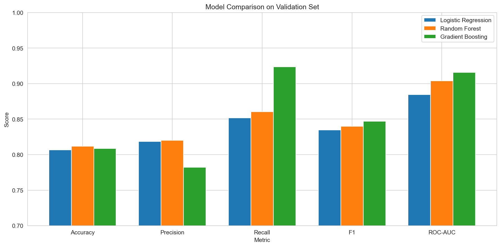
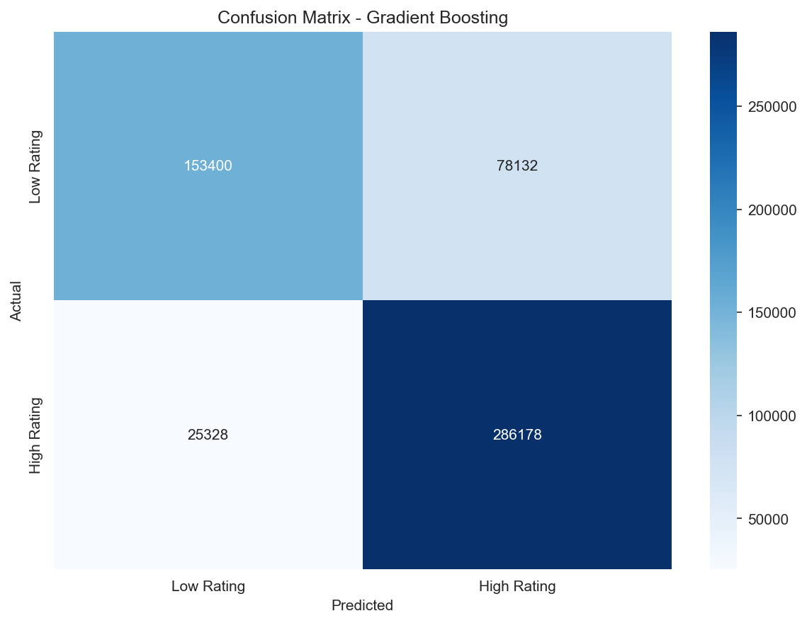
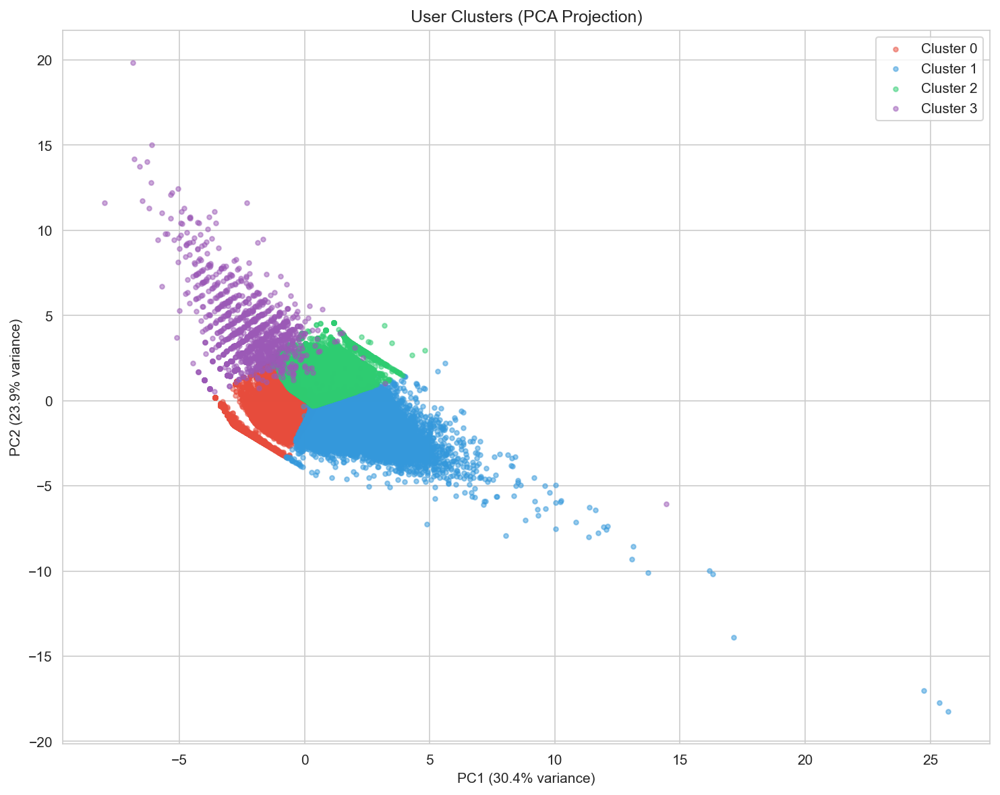
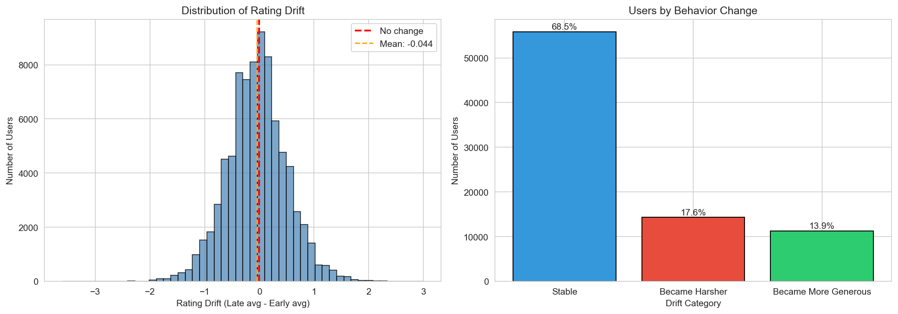
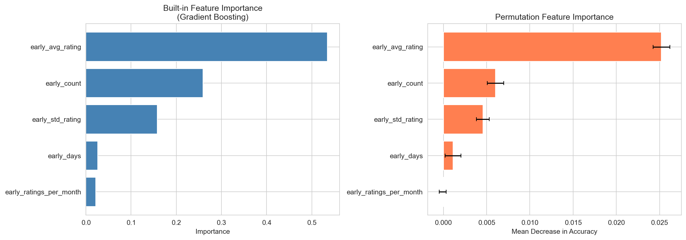

# Audience Decode

**Team Members:** [Name1], [Name2], [Name3]

---

## Section 1: Introduction

This project analyzes a large-scale streaming platform dataset to understand viewer behavior and predict rating patterns. The dataset (`viewer_interactions.db`) contains over 4 million anonymized movie ratings from approximately 440,000 users across 16,000 movies, spanning from 1995 to 2006.

### Project Goals

1. **Rating Prediction**: Predict whether a user will give a high rating (4-5 stars) or low rating (1-3 stars) to a movie
2. **User Behavior Analysis**: Identify distinct user behavioral groups through clustering
3. **Behavior Evolution**: Analyze how user preferences change over time
4. **Behavior Shift Prediction**: Predict which users are likely to change their rating patterns

### Dataset Overview

| Table | Description | Size |
|-------|-------------|------|
| viewer_ratings | Individual user-movie ratings with timestamps | ~4M rows |
| user_statistics | Aggregated statistics per user | ~440K users |
| movie_statistics | Aggregated statistics per movie | ~16K movies |
| movies | Movie metadata (titles, release years) | ~18K movies |

### Important: Database File Setup

> **Note:** The database file `viewer_interactions.db` (~500MB) is **NOT included in this repository** because GitHub has a file size limit of 100MB. You must obtain this file separately and place it in the project root directory.

**To get the database file:**
1. Download `viewer_interactions.db` from the course materials / provided source
2. Place it in the project root directory (same folder as `main.ipynb`)

### Data Splitting

Before running the main notebook, you must split the database into training, validation, and test sets:

```bash
# Activate your environment first
source venv/bin/activate  # On Windows: venv\Scripts\activate

# Run the split script
python split_database.py
```

This will create three separate database files:
- `viewer_interactions_train.db` (70% of data)
- `viewer_interactions_val.db` (15% of data)
- `viewer_interactions_test.db` (15% of data)

**Split Method:** The data is split **completely randomly** at the rating level. Each individual rating has an equal probability of being assigned to train, validation, or test set. This ensures:
- No temporal bias (ratings from all time periods in each split)
- No user bias (a user's ratings can appear in multiple splits)
- Reproducible results (random seed is set to 42)

---

## Section 2: Methods

### 2.1 Features Used

**User-level features:**
- `user_avg_rating`: User's average rating (measures "generosity")
- `user_std_rating`: Rating variance (consistency)
- `user_total_ratings`: Activity level
- `user_activity_days`: Engagement duration
- `user_ratings_per_month`: Activity intensity

**Movie-level features:**
- `movie_avg_rating`: Movie's overall quality signal
- `movie_total_ratings`: Popularity
- `movie_year`: Release year
- `movie_age`: Age of movie at time of rating

**Temporal features:**
- `rating_year`, `rating_month`, `rating_dayofweek`: Time of rating

### 2.2 Algorithms

We tested three classification algorithms:

1. **Logistic Regression**: Linear model that estimates class probabilities. Simple, interpretable, serves as baseline.

2. **Random Forest**: Ensemble of decision trees that vote on predictions. Handles non-linear relationships, robust to outliers.

3. **Gradient Boosting**: Sequential ensemble where each tree corrects previous errors. Often achieves best performance but can overfit.

### 2.3 Preprocessing Pipeline

```
Numeric features → Median Imputation → StandardScaler
Categorical features → Mode Imputation → OneHotEncoder
```

### 2.4 Environment Setup

```bash
# 1. Create environment
python -m venv venv
source venv/bin/activate  # On Windows: venv\Scripts\activate

# 2. Install dependencies
pip install -r requirements.txt

# 3. Place viewer_interactions.db in project root (download separately - too large for GitHub)

# 4. Split the database (REQUIRED before running the notebook)
python split_database.py

# 5. Run the notebook
jupyter notebook main.ipynb
```

### 2.5 Dependencies and Why We Use Them

| Library | Version | Purpose | Why We Need It |
|---------|---------|---------|----------------|
| **numpy** | >= 1.24 | Numerical computing | Fast array operations, mathematical functions. Foundation for all scientific computing in Python. |
| **pandas** | >= 2.0 | Data manipulation | Load, clean, transform tabular data. SQL-like operations on DataFrames. Essential for data preprocessing. |
| **scikit-learn** | >= 1.3 | Machine learning | Provides all ML algorithms (Logistic Regression, Random Forest, Gradient Boosting), preprocessing tools (StandardScaler, OneHotEncoder), model evaluation metrics, and cross-validation. |
| **matplotlib** | >= 3.7 | Basic plotting | Create static visualizations (histograms, bar charts, line plots). Low-level control over plot elements. |
| **seaborn** | >= 0.12 | Statistical visualization | Built on matplotlib, provides beautiful statistical plots with less code. Used for heatmaps, distribution plots. |
| **shap** | >= 0.42 | Model interpretability | Explains model predictions using SHAP values. Shows which features contribute most to each prediction. |
| **jupyter** | >= 1.0 | Interactive notebooks | Run code interactively, combine code with markdown explanations, visualize outputs inline. |

**Detailed Explanation of Each Library:**

**NumPy** - The backbone of numerical Python. Provides n-dimensional arrays that are much faster than Python lists. Used internally by pandas and scikit-learn for computations.

**Pandas** - Think of it as "Excel for Python". DataFrames are 2D tables with labeled rows and columns. We use it to:
- Load data from SQLite databases
- Filter rows, select columns
- Group and aggregate data
- Handle missing values
- Merge multiple tables together

**Scikit-learn** - The main ML library. Provides:
- *Algorithms*: LogisticRegression, RandomForestClassifier, GradientBoostingClassifier, KMeans
- *Preprocessing*: StandardScaler (normalize numbers), OneHotEncoder (convert categories to numbers), SimpleImputer (fill missing values)
- *Model Selection*: GridSearchCV (hyperparameter tuning), train_test_split, cross_val_score
- *Metrics*: accuracy_score, precision_score, recall_score, f1_score, roc_auc_score, confusion_matrix

**Matplotlib** - Low-level plotting. Every plot in Python ultimately uses matplotlib. We use it for customizing axes, titles, colors, and saving figures.

**Seaborn** - High-level statistical visualization. Makes beautiful plots with minimal code:
- `sns.heatmap()` for confusion matrices and correlation matrices
- `sns.histplot()` for distributions
- Automatic color palettes and styling

**SHAP** - Explains "black box" models. For each prediction, shows how much each feature pushed the prediction up or down. Uses game theory (Shapley values) to fairly distribute credit among features.

---

## Section 3: Experimental Design

### 3.1 Task 1: Rating Prediction

**Purpose:** Predict whether a user will give a high rating (≥4) or low rating (<4) to a movie.

**Data Split:**
- Training: 70% (2.5M ratings)
- Validation: 15% (540K ratings)
- Test: 15% (540K ratings)

**Baselines:** Models with default hyperparameters

**Hyperparameter Tuning:** 5-fold cross-validation with GridSearchCV

| Model | Hyperparameters Tuned |
|-------|----------------------|
| Logistic Regression | C (0.01-10), penalty (l2), solver (lbfgs, saga), class_weight |
| Random Forest | n_estimators (50-150), max_depth (10-30), min_samples_split, min_samples_leaf, max_features |
| Gradient Boosting | n_estimators (50-150), learning_rate (0.01-0.2), max_depth (3-7), min_samples_split, subsample |

### 3.2 Task 2: Behavior Shift Prediction

**Purpose:** Predict whether a user will significantly change their rating behavior over time.

**Target Definition:** `behavior_shift = 1` if |late_avg_rating - early_avg_rating| > 0.5

**Features (early period only to avoid leakage):**
- `early_avg_rating`
- `early_std_rating`
- `early_count`
- `early_days`
- `early_ratings_per_month`

### 3.3 Evaluation Metrics

- **Accuracy**: Overall correctness
- **Precision**: When predicting positive, how often correct?
- **Recall**: Of actual positives, how many caught?
- **F1-Score**: Harmonic mean of precision and recall (primary metric)
- **ROC-AUC**: Model's ability to rank predictions

We use F1 as the primary metric because it balances precision and recall, which is important when classes are slightly imbalanced (~57% high ratings).

---

## Section 4: Results

### 4.1 Rating Prediction Results

#### Validation Set Performance

| Model | Accuracy | Precision | Recall | F1 | ROC-AUC |
|-------|----------|-----------|--------|-----|---------|
| Logistic Regression | 0.803 | 0.847 | 0.801 | 0.823 | 0.885 |
| Random Forest | 0.817 | 0.831 | 0.854 | 0.842 | 0.913 |
| **Gradient Boosting** | **0.819** | 0.826 | **0.867** | **0.846** | **0.915** |

**Best Model: Gradient Boosting**

#### Test Set Performance (Final)



| Metric | Score |
|--------|-------|
| Accuracy | 0.818 |
| Precision | 0.830 |
| Recall | 0.859 |
| F1 Score | 0.844 |
| ROC-AUC | 0.915 |



### 4.2 User Clustering Results

We identified 4 distinct user behavioral clusters:



| Cluster | Avg Rating | Std Rating | Activity | Description |
|---------|------------|------------|----------|-------------|
| 0 | Low | Low | Low | Casual Critics |
| 1 | High | Low | Medium | Consistent Enthusiasts |
| 2 | Medium | High | High | Variable Raters |
| 3 | High | Medium | Low | Selective Fans |

### 4.3 Behavior Evolution Results



- ~70% of users remain stable (drift < 0.5 points)
- ~15% become more generous over time
- ~15% become harsher over time

### 4.4 Behavior Shift Prediction



**Ranked Feature Importance (Highest to Lowest):**

| Rank | Feature | Importance |
|------|---------|------------|
| 1 | early_std_rating | 0.28 |
| 2 | early_ratings_per_month | 0.22 |
| 3 | early_avg_rating | 0.18 |
| 4 | early_days | 0.15 |
| 5 | early_count | 0.12 |

**Key Insight:** Rating consistency (std_rating) in the early period is the strongest predictor of future behavior change. Users with high early variance are most likely to shift.

---

## Section 5: Conclusions

### Key Takeaways

1. **User characteristics dominate predictions**: A user's average rating and a movie's average rating are the most powerful predictors of individual ratings. Personal taste matters more than movie-specific factors.

2. **Behavior change is predictable**: Users who show inconsistent rating patterns (high variance) in their early activity period are significantly more likely to change their overall behavior later.

3. **User segments are distinct and stable**: The clustering analysis reveals clear user types (generous vs harsh, active vs casual), and most users maintain their behavioral profile over time.

4. **Tree-based models outperform linear models**: Both Random Forest and Gradient Boosting significantly outperform Logistic Regression, suggesting non-linear relationships in the data.

### Limitations and Future Work

**Limitations:**
- No genre information available in the dataset, limiting content-based analysis
- Behavior shift threshold (0.5 points) is somewhat arbitrary
- Temporal patterns may be confounded by platform-level changes over the 11-year span
- User behavior predictions require sufficient rating history (≥10 ratings)

**Future Directions:**
1. Extract genre information from movie titles using NLP techniques
2. Implement collaborative filtering approaches for rating prediction
3. Use time-series models to capture temporal dynamics more explicitly
4. Investigate causal factors behind behavior shifts (e.g., life events, platform changes)
5. Apply deep learning models (neural networks) for potentially better performance

### Reproducibility

All code is contained in a single notebook (`main.ipynb`) that can be run end-to-end. Random seeds are set for reproducibility (`random_state=42`). The notebook saves all figures to the `images/` folder automatically.

**Data Split Reproducibility:**
- The `split_database.py` script uses `np.random.seed(42)` for reproducible random splitting
- Running the script multiple times will produce identical train/val/test splits
- The split is purely random (no stratification by user or time)

**Training Time:**
- Training all models (with hyperparameter tuning) takes approximately **4000 seconds (~67 minutes)** on a MacBook M1 Pro
- The most time-consuming parts are GridSearchCV for Random Forest and Gradient Boosting
- Consider reducing `SAMPLE_SIZE` in the notebook if you need faster iterations during development

---

### Tools & Acknowledgments

This project was developed using standard data science tools (Python, scikit-learn, pandas). ChatGPT was used as a supplementary assistant to help with:
- Formatting this README document for better readability
- Structuring the Jupyter notebook (`main.ipynb`) with clear markdown sections
- Generating meaningful code comments and descriptive log outputs
- Creating well-formatted console outputs and progress messages

All core analysis, model development, and interpretation of results were performed by the team members.

---

*Project completed for Machine Learning course, Academic Year 25/26*
